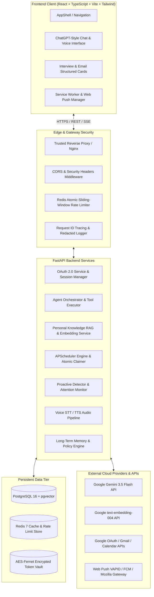

# Personal AI Assistant — Comprehensive Features & Architecture

> **A production-grade, multi-user Personal AI Assistant application powered by Google Gemini, Google Workspace OAuth 2.0 (read-only Gmail & Calendar), Semantic RAG Knowledge Retrieval, Proactive Event Monitoring, Voice Interaction, and Long-Term Personalization.**

---

## 1. High-Level Architecture Overview

---

## 2. Complete Feature Catalog

### 1. Google OAuth 2.0 & Identity Security
- **Strict Read-Only Scopes**: Enforces minimal least-privilege scopes (`openid`, `userinfo.email`, `userinfo.profile`, `gmail.readonly`, `calendar.readonly`).
- **Cryptographic CSRF Protection**: Multi-attempt HMAC-SHA256 signed state tokens with a 10-minute TTL stored in HttpOnly cookies.
- **AES-128 Fernet Encryption at Rest**: All access and refresh tokens are encrypted at rest using server-side key derivation (`SecurityManager`).
- **Truthful Scope Verification**: Verifies granted permissions directly via Google's `tokeninfo` endpoint and prompts users with clean reconnect banners if permissions are missing.
- **Automatic Token Refresh**: Seamlessly refreshes expired OAuth access tokens with exponential backoff and jitter without interrupting user queries.

### 2. Gmail Read-Only Intelligence & Email Triage
- **MIME/RFC 2047 Parser**: Robust email decoding supporting multi-part MIME, nested text/html bodies, quoted-printable encoding, and international character sets.
- **HTML Sanitization**: Strips executable scripts, styles, iframes, and dangerous attributes from incoming email contents to ensure 100% XSS immunity.
- **Single-Turn Search Optimization**: Batch-queries messages and prevents excessive LLM API roundtrips.
- **Interview Classification & Time Awareness**:
  - Automatically parses interview schedules and deadlines.
  - Classifies messages into `UPCOMING`, `PENDING_ACTION`, or `EXPIRED_PAST` relative to the current timestamp.
  - Excludes outdated or completed interviews from upcoming summaries.
- **On-Demand Smart Reply Drafting**:
  - Explicit user-triggered "Generate Reply" workflow on every email (zero automatic generation on sync/list/dashboard).
  - Multi-tone generation (`professional`, `friendly`, `concise`, `formal`, `direct`) with user custom instructions.
  - Anti-hallucination guardrails preventing invented meeting commitments or fake availability by utilizing bracketed placeholders (`[Your Available Times]`, `[Your Phone Number]`).
  - Strict prompt injection defense treating external email data as passive, untrusted content inside `<untrusted_email_content>` boundaries.
  - Client-side draft isolation preserving individual email edits without cross-message pollution or unauthorized Gmail sending.
- **Enhanced Email Detail Modal & Body Rendering**:
  - `EmailBodyViewer` renders long tracking URLs with messy query parameters as clean, clickable link pills (e.g. "View in browser", "Unsubscribe Link", or domain summaries).
  - Automatically isolates marketing boilerplate and newsletter footers behind an expandable "Show full email" toggle while preserving the complete original email.
  - Responsive modal with pinned header and footer, accessible read-only access indicators, and strict vertical-only scrolling (`overflow-y-auto overflow-x-hidden`).

### 3. Google Calendar Integration & Agenda Management
- **Date-Range RFC 3339 Filtering**: Timezone-aware event queries across primary and secondary calendars.
- **Recurring Event Expansion**: Expands recurring meeting instances and handles all-day vs. timed appointments.
- **Meeting Metadata Extraction**: Extracts Google Meet / Zoom conference links, organizer metadata, and attendee RSVP statuses (`accepted`, `declined`, `needsAction`).

### 4. Tasks & Multi-Schedule Reminder Engine
- **Task Lifecycle Management**: Full CRUD operations with priority tagging (`high`, `medium`, `low`), due dates, and completion status.
- **RFC 5545 Recurrence**: Supports one-time, daily, weekly, and monthly recurrence rules with timezone & DST safety.
- **Atomic Concurrency Claiming**: APScheduler background runner with atomic database claiming (`WHERE status = 'pending' ... rowcount == 1`) preventing duplicate trigger executions across multi-worker environments.
- **Snooze & Action Workflows**: In-app snooze options (15m, 1h, custom future timestamps) with deterministic idempotency keys.

### 5. Intelligent AI Agent Core & Safe Tool Calling
- **Model Agnostic Provider Layer**: Seamless integration with Google Gemini (`gemini-3.5-flash`) with bounded transient retry (max 2 retries) and fast-fail delay ceilings.
- **Static Tool Registry & Risk Classification**:
  - `READ`: Safe read operations (e.g. searching Gmail, listing calendar events, querying tasks).
  - `LOW_RISK_WRITE`: Low-risk operations (e.g. creating tasks, scheduling reminders).
  - `HIGH_RISK_WRITE`: Dangerous operations (e.g. deleting tasks, clearing memories) requiring explicit user confirmation.
- **HMAC One-Time Confirmation Challenge**: High-risk tools generate single-use, cryptographically signed confirmation tokens (`ConfirmationChallenge`) requiring user verification before execution.
- **Untrusted External Data Tagging**: All tool outputs from external sources (emails, calendar events) are tagged as untrusted data (`trusted: False`) to prevent indirect prompt injection.
- **Direct Fallback Synthesis**: If Gemini hits 429 rate limits during synthesis, structured tool outputs are automatically formatted into readable answers without losing retrieved data.

### 6. Personal Knowledge RAG & Semantic Retrieval
- **Vector Embeddings**: Generates 768-dimensional embeddings using Google's `text-embedding-004` REST endpoint.
- **Deterministic Chunking & Deduplication**: Boundary-aware document chunking (500 chars with 75-char overlap) with SHA-256 content hashing to avoid redundant embedding API calls.
- **pgvector Cosine Search**: User-isolated HNSW vector index in PostgreSQL enabling sub-millisecond semantic search across emails, tasks, and notes.
- **Citation Control**: Deterministic citation formatting (`[cit_1]`, `[cit_2]`) strictly referencing grounded source chunks.

### 7. Proactive Event & Attention Monitoring
- **Background Attention Cycle**: Periodically scans for calendar conflicts, overdue tasks, pending reminders, and urgent emails.
- **PostgreSQL Distributed Advisory Lock**: Employs global advisory lock `84920184` to ensure only one worker executes the proactive scanning cycle at any time.
- **Preference Guardrails**: Respects user opt-in preferences, quiet hours (e.g. 22:00–07:00), category toggles, and daily notification budget caps (max 15/day).

### 8. Voice & Multimodal Interaction
- **Speech-to-Text (STT)**: Fast voice audio transcription via Gemini multimodal audio processing.
- **Text-to-Speech (TTS)**: Natural voice synthesis with automatic graceful degradation to text if TTS fails.
- **Audio Privacy**: Audio buffers are processed in-memory and never persisted to filesystem logs.

### 9. Long-Term Personal Memory & Personalization
- **Memory Store**: Explicit and inferred long-term personal facts and preferences with confidence scoring.
- **Policy Engine**: Configurable personalization levels (`LOW`, `MEDIUM`, `HIGH`) and category toggles (response style, project context, workflow habits).
- **Session Overrides & Redis Cache**: Temporary per-turn preference overrides and 5-minute Redis preference caching.

### 10. Progressive Web App (PWA) & Web Push Notifications
- **VAPID Web Push**: Standard-compliant Web Push (RFC 8291 / RFC 8292) with auto-generated P-256 EC keys in development.
- **Service Worker Lifecycle**: Reuses in-flight registrations and handles offline fallback caching.
- **Cross-Device Delivery**: Real-time push notification dispatch to mobile and desktop browsers for due reminders and proactive alerts.

### 11. ChatGPT-Grade Rich UI & Message Renderer
- **Markdown & Entity Decoding**: Automatically decodes HTML entities (`&#39;`, `&quot;`, `&amp;`) and cleans escaped markdown.
- **Interactive Interview Cards**: Renders upcoming, action-required, and past interviews in distinct glowing cards with date/time, recruiter, and Gmail shortcuts.
- **Email Summary Cards**: Formats search results into clean, readable cards.
- **Syntax Code Blocks**: Multi-line code blocks with language indicators and one-click copy buttons.
- **Responsive Tables & Quotes**: Clean Markdown tables with horizontal scrolling and styled blockquotes.

---

## 3. Technology Stack

| Layer | Technologies |
| :--- | :--- |
| **Frontend** | React 18, TypeScript, Vite, TailwindCSS, Lucide React Icons |
| **Backend API** | FastAPI (Python 3.12), Pydantic v2, Starlette |
| **AI & LLM** | Google Gemini (`gemini-3.5-flash`), Google `text-embedding-004` |
| **Database & ORM** | PostgreSQL 16 + `pgvector` extension, SQLAlchemy 2.0 (AsyncIO), Alembic |
| **Caching & Rate Limiting** | Redis 7 (Atomic Lua sliding-window scripts) |
| **Scheduling** | APScheduler (AsyncIOScheduler) |
| **Authentication** | Google OAuth 2.0 (Web Server Flow), AES-128 Fernet, HMAC-SHA256 |
| **Push Notifications** | Web Push (VAPID, `pywebpush`, Service Worker) |
| **Containerization** | Docker, Multi-Stage Dockerfile (Non-root `appuser`), Docker Compose |

---

## 4. Production Security & Resilience Guarantees

1. **Multi-Tenant User Isolation**: Every database query, vector search, memory lookup, and Google API request is strictly scoped to the authenticated `user.id`.
2. **Zero Traceback / SQL Leakage**: Standardized global exception handlers log internal details privately while returning clean error envelopes with unique `X-Request-ID` correlation identifiers.
3. **Prompt Injection Defense**: Segregated tool execution environments treat all external email and calendar text as untrusted data inputs.
4. **Distributed Sliding-Window Rate Limiting**: Multi-tier rate limiting protects auth endpoints, agent chat turns, voice synthesis, and standard APIs against saturation attacks.
5. **Fail-Closed Security Endpoints**: Critical authentication and confirmation endpoints fail closed if Redis is unavailable in production.
